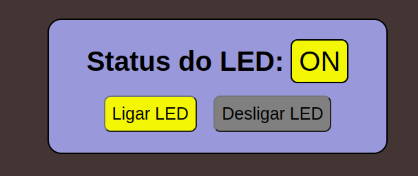

# Remote Control ESP32 by Serial

<h1 align="center">
    
</h1>

# Índice

- [Sobre](#-Sobre)
- [Recursos utilizados](#-Recursos-utilizados)
- [Como baixar o projeto](#-Como-baixar-o-projeto)

---

## Sobre

O projeto **Remote Control ESP32 by Serial** consiste em uma conexão de um programa gravado em uma placa ESP32 com um servidor NODEJS através de interface serial. No ESP32 há um LED conectado à porta 14 e um botão conectado à porta 12, o botão faz o toggle do led. O servidor Node também controla o liga/desliga do led remotamente, apresentando o status atual do led em uma página HTML, nessa página estão os botões liga e desliga do led (conforme visto na figura acima).

---

## Recursos utilizados

Foram utilizados os seguintes recursos:

### ESP32
- Placa DOIT Devkit 01
- 1 led 5 mm -> conectado ao pino 14 da ESP32
- 1 pushbutton -> conectado entre o pino 12 da ESP32 e o GND (com PULLUP habilitado)
- 1 resistor 1 kohm -> conectado entre o led e o GND
- fios 
- protoboard
- Programado em C++ usando o framework [Arduino](https://www.arduino.cc/) no [Visual Studio Code](https://code.visualstudio.com/) com [Platformio](https://platformio.org/)

### Servidor Node
- Usada versão v18.14.0
- pacote do microframework Express v4.18.2
- pacote serialPort v10.5.0
- pacote ejs v3.1.8
- HTML
- CSS
- JavaScript

---

## Como baixar o projeto

```bash
    # Clonar o repositório
    $ git clone https://github.com/AndreDalSantos/Led-connected-to-esp32-controlled-by-NodeJS-server-with-Serial-communication.git

    # Acessar o diretório
    $ cd Led-connected-to-esp32-controlled-by-NodeJS-server-with-Serial-communication
```
### Esp32 Ligações e gravação do firmware na placa

- Ligações
```
    - LED - Anodo ligado ao pino 14 da ESP32
    - LED - Catodo ligado ao terminal 1 resistor de 1 kohm
    - Terminal 2 do resistor 1 kohm ligado ao terra
    - Terminal 1 do push button ligado ao pino 12 da ESP32
    - Terminal 2 do push button ligado ao GND
    - ALimentar a placa pelo cabo USB
```

- Abrir com o Platformio e VSCode o projeto na pasta Led-connected-to-esp32-controlled-by-NodeJS-server-with-Serial-communication/ESP32_Code
- Observar em qual porta USB ficou conectada a placa
- Gravar o programa na placa

### Para instalar as dependências de pacotes e inicar o servidor Node

```bash
    # acesar diretório da aplicação NodeJS
    $ cd Led-connected-to-esp32-controlled-by-NodeJS-server-with-Serial-communication/NodeCode

    # Instalar as dependências
    $ npm install
```

Observar em qual porta USB ficou conectada a placa ESP32, pode ser necessário alterar a linha do código Node (em /Led-connected-to-esp32-controlled-by-NodeJS-server-with-Serial-communication/NodeCode/src/server.js) que informa o nome da porta para conexão
```js
    path: '/dev/ttyUSB0',
```

Iniciando o servidor
```bash
    # iniciar o servidor Node
    $ node src/server.js
```

Após estas etapas abrir o browser e acessar o endereço http://localhost:3000


---

Desenvolvido por Engº André Dal Santos